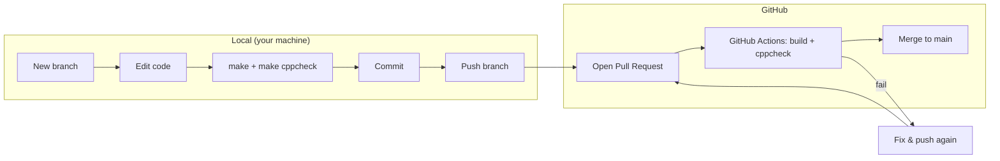
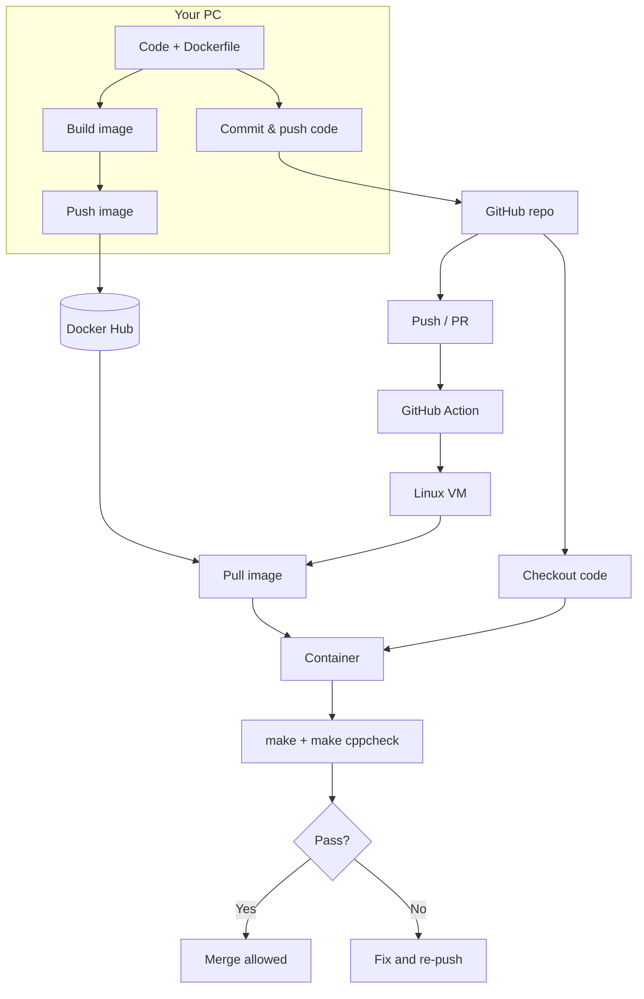
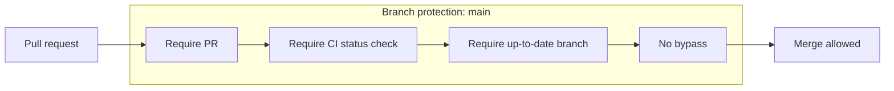

# Episode 10 – CI/CD Top Level

## 1. High-level workflow (lifecycle)



## 2. Where things run (containers & repo)



## 3. CI job steps (sequence)

```mermaid
sequenceDiagram
    participant Dev as Developer
    participant GH as GitHub
    participant VM as GitHub runner (Ubuntu VM)
    participant DH as Docker Hub
    participant Box as Container (MSP430 toolchain)

    Dev->>GH: Push branch / open PR
    GH->>VM: Start workflow
    VM->>DH: docker pull artful-bytes-msp430
    DH-->>VM: Image
    VM->>Box: Start container
    VM->>GH: Checkout repo into container
    GH-->>Box: Source code
    Box->>Box: make (TOOLS_PATH=/dev/tools)
    Box->>Box: make cppcheck
    alt All pass
        Box-->>VM: Success
        VM-->>GH: Status: pass → merge allowed
    else Build or cppcheck fails
        Box-->>VM: Failure
        VM-->>GH: Status: fail → merge blocked
        GH-->>Dev: Fix and re-push
    end
```

## 4. Main branch protection (rules)

